<p align="center">
  
</p>

<h1 align="center">🚨 Hack23 AB — Incident Response Plan</h1>

<p align="center">
  <strong>Rapid Response Through Systematic Security Incident Management</strong><br>
  <em>Classification-Driven Response • Automated Escalation • Transparent Communication</em>
</p>

<p align="center">
  <a href="#"></a>
  <a href="#"></a>
  <a href="#"></a>
  <a href="#"></a>
</p>


**📋 Document Owner:** CEO | **📄 Version:** 1.2 | **📅 Last Updated:** 2025-11-17 (UTC)  
**🔄 Review Cycle:** Quarterly | **⏰ Next Review:** 2026-02-16

---

## 🎯 **Purpose Statement**

**Hack23 AB's** incident response framework demonstrates how **systematic security incident management directly enables business resilience and stakeholder confidence.** Our approach serves as both operational necessity and client demonstration of professional cybersecurity incident handling capabilities.

This plan establishes comprehensive procedures for detecting, analyzing, containing, eradicating, and recovering from security incidents using our [🏷️ Classification Framework](https://github.com/Hack23/ISMS-PUBLIC/blob/main/CLASSIFICATION.md) for impact assessment and response prioritization. All incidents are managed through transparent communication and measurable response times aligned with our business continuity requirements.

Our incident response capabilities showcase systematic security operations and rapid response coordination, demonstrating the very incident management excellence we deliver to our consulting clients.

*— James Pether Sörling, CEO/Founder*

---

## 🔍 **Purpose & Scope**

This plan establishes the framework for systematically responding to all security incidents affecting Hack23 AB information assets, services, and operations.

**Scope:** All security incidents affecting assets documented in [💻 Asset Register](./Asset_Register.md), including:
- **🚨 Security Breaches:** Unauthorized access, data exposure, system compromise
- **🔍 Vulnerability Incidents:** Critical vulnerability exploitation, zero-day attacks  
- **☁️ Service Disruptions:** AWS outages, supplier failures, system unavailability
- **📦 Supply Chain Incidents:** Supplier security breaches, dependency compromises
- **🔐 Data Incidents:** Data loss, corruption, unauthorized disclosure

**Policy Integration:**
- **🔍 Vulnerability Management:** Aligned with [🔍 Vulnerability Management](./Vulnerability_Management.md) response procedures
- **🤝 Third Party Management:** Integrated with [🤝 Third Party Management](./Third_Party_Management.md) supplier coordination
- **🔐 Information Security:** Supporting [🔐 Information Security Policy](./Information_Security_Policy.md) governance framework

---

## 📊 **Incident Classification & Response Framework**

### **🎯 Impact-Based Classification Matrix**

Using [🏷️ Classification Framework](https://github.com/Hack23/ISMS-PUBLIC/blob/main/CLASSIFICATION.md) business impact analysis:

```mermaid
%%{
  init: {
    'theme': 'base',
    'themeVariables': {
      'primaryColor': '#e3f2fd',
      'primaryTextColor': '#0d47a1',
      'lineColor': '#42a5f5',
      'secondaryColor': '#ffebee',
      'tertiaryColor': '#fff3e0'
    }
  }
}%%
flowchart TD
    INCIDENT[🚨 Security Incident Detected] --> ASSESS[📊 Business Impact Assessment]
    
    ASSESS --> CRITICAL{🔴 Critical Impact?<br/>€10K+ daily loss<br/>Complete outage<br/>Criminal liability}
    ASSESS --> HIGH{🟠 High Impact?<br/>€5-10K daily loss<br/>Major degradation<br/>Significant fines}
    ASSESS --> MEDIUM{🟡 Medium Impact?<br/>€1-5K daily loss<br/>Partial impact<br/>Minor penalties}
    ASSESS --> LOW{🟢 Low Impact?<br/><€1K daily loss<br/>Minor inconvenience<br/>No implications}
    
    CRITICAL -->|YES| C_RESPONSE[🔴 Critical Response<br/>< 30 min response<br/>< 4 hr resolution<br/>All stakeholders]
    HIGH -->|YES| H_RESPONSE[🟠 High Response<br/>< 1 hr response<br/>< 24 hr resolution<br/>Key stakeholders]
    MEDIUM -->|YES| M_RESPONSE[🟡 Medium Response<br/>< 4 hr response<br/>< 72 hr resolution<br/>Internal only]
    LOW -->|YES| L_RESPONSE[🟢 Low Response<br/>< 24 hr response<br/>< 1 week resolution<br/>Documentation]
    
    style INCIDENT fill:#ff6f00,color:#fff
    style ASSESS fill:#2196f3,color:#fff
    style CRITICAL fill:#d32f2f,color:#fff
    style HIGH fill:#ff9800,color:#fff
    style MEDIUM fill:#ffc107,color:#000
    style LOW fill:#4caf50,color:#fff
    style C_RESPONSE fill:#ffcdd2,stroke:#d32f2f,stroke-width:3px
    style H_RESPONSE fill:#ffe0b2,stroke:#ff9800,stroke-width:2px
    style M_RESPONSE fill:#fff9c4,stroke:#ffc107,stroke-width:2px
    style L_RESPONSE fill:#c8e6c9,stroke:#4caf50,stroke-width:2px
```



#### **📋 Incident Response SLA Matrix**

| Incident Level | Detection Target | Response Time | Resolution Target | Escalation | Communication |
|----------------|------------------|---------------|-------------------|------------|---------------|
| **🔴 Critical** | [](https://github.com/Hack23/ISMS-PUBLIC/blob/main/CLASSIFICATION.md) | **<30 minutes** | **<4 hours** | Immediate CEO | All stakeholders |
| **🟠 High** | [](https://github.com/Hack23/ISMS-PUBLIC/blob/main/CLASSIFICATION.md) | **<1 hour** | **<24 hours** | <1 hour CEO | Key stakeholders |
| **🟡 Medium** | [](https://github.com/Hack23/ISMS-PUBLIC/blob/main/CLASSIFICATION.md) | **<4 hours** | **<72 hours** | <4 hours | Internal only |
| **🟢 Low** | [](https://github.com/Hack23/ISMS-PUBLIC/blob/main/CLASSIFICATION.md) | **<24 hours** | **<1 week** | Daily report | Documentation |

---

## 🔄 **Incident Response Process**

### **Phase 1: Detection & Initial Assessment (0-30 minutes)**

#### **🚨 Detection Sources & Integration**


#### **📊 Initial Response Actions (First 15 Minutes)**

| Action | Responsibility | Tools | Success Criteria |
|--------|---------------|-------|------------------|
| **🔍 Incident Confirmation** | CEO | AWS Detective, Security Hub | Incident validated and classified |
| **📊 Impact Assessment** | CEO | Classification Framework | Business impact determined |
| **🚨 Stakeholder Notification** | CEO | Communication matrix | Key stakeholders alerted |
| **📋 Evidence Preservation** | Automated + CEO | AWS native logging | Evidence secured for analysis |

### **Phase 2: Investigation & Analysis (30 minutes - 4 hours)**

#### **🕵️ AWS Detective-Powered Investigation**

```mermaid
%%{
  init: {
    'theme': 'base',
    'themeVariables': {
      'primaryColor': '#fff8e1',
      'primaryTextColor': '#f57f17',
      'lineColor': '#ffb300'
    }
  }
}%%
flowchart TD
    ALERT[🚨 Security Alert] --> DETECTIVE[🕵️ AWS Detective Analysis]
    
    DETECTIVE --> ENTITIES[👤 Entity Analysis]
    DETECTIVE --> TIMELINE[⏰ Timeline Construction]
    DETECTIVE --> RELATIONSHIPS[🔗 Relationship Mapping]
    DETECTIVE --> EVIDENCE[📋 Evidence Collection]
    
    ENTITIES --> E1[User Activity<br/>IP Addresses<br/>AWS Resources<br/>API Calls]
    
    TIMELINE --> T1[Event Sequence<br/>Attack Progression<br/>Impact Timeline<br/>Response Windows]
    
    RELATIONSHIPS --> R1[Service Interactions<br/>Network Connections<br/>Data Flow<br/>Access Patterns]
    
    EVIDENCE --> EV1[CloudTrail Events<br/>VPC Flow Logs<br/>DNS Logs<br/>GuardDuty Findings]
    
    E1 --> ASSESSMENT[📊 Impact Assessment]
    T1 --> ASSESSMENT
    R1 --> ASSESSMENT
    EV1 --> ASSESSMENT
    
    ASSESSMENT --> RESPONSE[🚀 Response Strategy]
    
    style DETECTIVE fill:#ff6f00,color:#fff
    style ASSESSMENT fill:#c8e6c9
    style RESPONSE fill:#4caf50,color:#fff
```



#### **🔍 AWS Detective Investigation Features**

| Investigation Capability | AWS Detective Feature | Business Value | Integration |
|-------------------------|----------------------|----------------|-------------|
| **🯠Automated Root Cause** | ML-powered analysis of security findings | [](https://github.com/Hack23/ISMS-PUBLIC/blob/main/CLASSIFICATION.md) | Security Hub findings |
| **📈 Behavioral Analytics** | Baseline comparison and anomaly detection | [](https://github.com/Hack23/ISMS-PUBLIC/blob/main/CLASSIFICATION.md) | GuardDuty insights |
| **🕸️ Relationship Mapping** | Visual entity relationship graphs | [](https://github.com/Hack23/ISMS-PUBLIC/blob/main/CLASSIFICATION.md) | Cross-service analysis |
| **⏰ Timeline Reconstruction** | Chronological event sequencing | [](https://github.com/Hack23/ISMS-PUBLIC/blob/main/CLASSIFICATION.md) | CloudTrail integration |
| **📊 Impact Visualization** | Interactive security dashboards | [](https://github.com/Hack23/ISMS-PUBLIC/blob/main/CLASSIFICATION.md) | Stakeholder reporting |

#### **📋 Investigation Checklist**

**🔍 AWS Detective Analysis:**
- [ ] **Entity Overview** - Affected users, roles, and resources identified
- [ ] **Timeline Reconstruction** - Complete event sequence with time correlation
- [ ] **Relationship Mapping** - Service interactions and dependencies visualized
- [ ] **Behavioral Analysis** - Comparison with historical baseline patterns
- [ ] **Evidence Collection** - CloudTrail, VPC Flow Logs, DNS logs aggregated

**🌐 External Investigation:**
- [ ] **GitHub Analysis** - Audit logs and security scanning results
- [ ] **Supplier Coordination** - Third-party incident reports and status
- [ ] **Threat Intelligence** - External feeds and IOC correlation

### **Phase 3: Containment & Eradication (1-8 hours)**

#### **🛡️ Containment Strategy by Asset Type**

| Asset Type | Containment Action | Implementation | Validation |
|------------|-------------------|----------------|------------|
| **☁️ AWS Infrastructure** | Isolate affected resources | Security group modifications, VPC isolation | Service health checks |
| **🐙 GitHub Repositories** | Revoke access tokens, reset secrets | Token revocation, secret rotation | Access validation |
| **🤝 Supplier Services** | Coordinate response, isolate connections | API disconnection, credential rotation | Service isolation |
| **📦 Dependencies** | Version rollback, patch application | Automated deployment rollback | Dependency validation |
| **💻 Endpoint Systems** | Network isolation, service shutdown | Remote isolation commands | Connectivity testing |

#### **🔧 Detective-Informed Eradication**

```mermaid
%%{
  init: {
    'theme': 'base',
    'themeVariables': {
      'primaryColor': '#f3e5f5',
      'primaryTextColor': '#7b1fa2',
      'lineColor': '#ba68c8'
    }
  }
}%%
flowchart LR
    DETECTIVE[🕵️ Detective Analysis] --> SCOPE[📏 Determine Scope]
    SCOPE --> ISOLATE[🔒 Isolate Affected Resources]
    ISOLATE --> REMEDIATE[🔧 Targeted Remediation]
    REMEDIATE --> VALIDATE[✅ Validate Cleanup]
    
    DETECTIVE --> D1[Affected Entities<br/>Attack Vectors<br/>Lateral Movement<br/>Data Impact]
    
    SCOPE --> S1[Resource Inventory<br/>Network Segments<br/>Account Boundaries<br/>Service Dependencies]
    
    ISOLATE --> I1[Security Group Updates<br/>IAM Policy Changes<br/>Network ACL Rules<br/>Service Isolation]
    
    REMEDIATE --> R1[Malware Removal<br/>Credential Rotation<br/>Configuration Reset<br/>Patch Application]
    
    VALIDATE --> V1[Detective Re-analysis<br/>Security Scanning<br/>Compliance Verification<br/>Monitoring Setup]
    
    style DETECTIVE fill:#ff6f00,color:#fff
    style VALIDATE fill:#c8e6c9
```



### **Phase 4: Recovery & Restoration (4-24+ hours)**

#### **📈 Service Recovery Process**

| Recovery Stage | Activities | Validation | Integration |
|----------------|------------|------------|-------------|
| **🔄 System Restoration** | Gradual service recovery, monitoring enhancement | Performance testing, functionality validation | [🆘 Disaster Recovery Plan](./Disaster_Recovery_Plan.md) |
| **📊 Baseline Updates** | Security baselines, monitoring thresholds | Alert validation, detection capability | [📊 Security Metrics](./Security_Metrics.md) |
| **📚 Process Improvement** | Procedure updates, lessons learned | Documentation completion, training delivery | [📝 Change Management](./Change_Management.md) |
| **🤝 Stakeholder Closure** | Final communications, satisfaction surveys | Stakeholder feedback, relationship maintenance | Communication matrix |

---

## 📢 **Communication & Stakeholder Management**

### **🎯 Stakeholder Communication Framework**

#### **📋 Communication Matrix by Incident Level**

Aligned with [🤝 Third Party Management](./Third_Party_Management.md) supplier communication requirements:

```mermaid
%%{
  init: {
    'theme': 'base',
    'themeVariables': {
      'primaryColor': '#e1f5fe',
      'primaryTextColor': '#01579b',
      'lineColor': '#0288d1'
    }
  }
}%%
graph TD
    INCIDENT[🚨 Security Incident] --> ASSESS{📊 Impact Level}
    
    ASSESS -->|Critical| CRIT_COMM[🔴 Critical Communication]
    ASSESS -->|High| HIGH_COMM[🟠 High Communication]  
    ASSESS -->|Medium| MED_COMM[🟡 Medium Communication]
    ASSESS -->|Low| LOW_COMM[🟢 Low Communication]
    
    CRIT_COMM --> CEO[👨‍💼 CEO: Immediate]
    CRIT_COMM --> INSURANCE[🛡️ Insurance: <1hr]
    CRIT_COMM --> LEGAL[⚖️ Legal: <1hr]
    CRIT_COMM --> CLIENTS[🤝 Clients: <2hrs]
    CRIT_COMM --> PUBLIC[🌐 Public: <1hr]
    
    HIGH_COMM --> CEO2[👨‍💼 CEO: <1hr]
    HIGH_COMM --> INSURANCE2[🛡️ Insurance: <4hrs]
    HIGH_COMM --> CLIENTS2[🤝 Clients: <4hrs]
    
    MED_COMM --> CEO3[👨‍💼 CEO: <4hrs]
    MED_COMM --> INTERNAL[🏢 Internal: <24hrs]
    
    LOW_COMM --> REPORT[📋 Daily Report]
    
    style CRIT_COMM fill:#ffcdd2
    style HIGH_COMM fill:#ffe0b2
    style MED_COMM fill:#fff9c4
    style LOW_COMM fill:#c8e6c9
```



#### **📞 Emergency Contact Directory**

| Stakeholder Type | Contact Method | Response Time | Information Level |
|------------------|---------------|---------------|-------------------|
| **👨‍💼 CEO (Self)** | Self-assessment | Immediate | Complete situational awareness |
| **☁️ AWS Support** | Enterprise Portal + Phone | <15 minutes | Technical incident details |
| **📝 GitHub Support** | Enterprise Portal | <1 hour | Repository and security issues |
| **🏦 Financial Institution** | Account Manager + Hotline | <4 hours | Financial impact and transactions |
| **🛡️ Insurance Provider** | Direct Phone + Email | <4 hours | Incident details and claim requirements |
| **⚖️ Legal Counsel** | Secure Email + Phone | <8 hours | Regulatory and compliance implications |
| **🤝 Active Clients** | Email + Status Page | <2 hours | Service impact and timeline |
| **🌐 Public Community** | Website + Social Media | <1 hour | Transparent status updates |

### **📧 Communication Templates & Procedures**

#### **🚨 Critical Incident Notification Template**

**Subject:** URGENT - Security Incident [INCIDENT-ID] - [BRIEF-DESCRIPTION]

**Recipients:** All stakeholders per communication matrix

```
🚨 CRITICAL SECURITY INCIDENT

Incident ID: [INCIDENT-ID]
Detection Time: [TIMESTAMP] CET
Current Status: [INVESTIGATING/CONTAINED/RESOLVED]

IMPACT ASSESSMENT:
- Financial Impact: [LEVEL + ESTIMATED COST]
- Operational Impact: [SERVICE STATUS]
- Data Impact: [DATA EXPOSURE STATUS]
- Regulatory Impact: [COMPLIANCE IMPLICATIONS]

IMMEDIATE ACTIONS TAKEN:
- [CONTAINMENT ACTIONS]
- [STAKEHOLDER NOTIFICATIONS]
- [SUPPLIER COORDINATION]

NEXT UPDATE: [TIMESTAMP] or significant change

Contact: James Pether Sörling, CEO
Direct: [CONTACT-INFO]
```

#### **📊 Incident Closure Report Template**

**Subject:** Incident [INCIDENT-ID] - Final Report and Lessons Learned

```
📋 INCIDENT SUMMARY REPORT

Incident Overview:
- ID: [INCIDENT-ID]
- Classification: [LEVEL]
- Duration: [START] to [END]
- Total Impact: [SUMMARY]

Root Cause Analysis:
- Primary Cause: [DESCRIPTION]
- Contributing Factors: [LIST]
- Timeline: [KEY EVENTS]

Response Effectiveness:
- Detection Time: [ACTUAL vs TARGET]
- Response Time: [ACTUAL vs TARGET] 
- Resolution Time: [ACTUAL vs TARGET]
- Communication Effectiveness: [ASSESSMENT]

Lessons Learned:
- What Worked Well: [LIST]
- Areas for Improvement: [LIST]
- Process Updates: [CHANGES MADE]

Preventive Measures:
- Technical Improvements: [LIST]
- Process Enhancements: [LIST]
- Training Requirements: [LIST]
```

#### **🔄 Communication Workflow**

```mermaid
%%{
  init: {
    'theme': 'base',
    'themeVariables': {
      'primaryColor': '#e1f5fe',
      'primaryTextColor': '#01579b',
      'lineColor': '#0288d1'
    }
  }
}%%
flowchart LR
    INCIDENT[🚨 Incident Detected] --> ASSESS[📊 Impact Assessment]
    
    ASSESS --> IMMEDIATE[⚡ Immediate Notifications]
    ASSESS --> PLANNED[📅 Planned Communications]
    ASSESS --> ONGOING[🔄 Ongoing Updates]
    
    IMMEDIATE --> I1[👨‍💼 CEO Self-Assessment<br/>☁️ Critical Suppliers<br/>🛡️ Insurance Provider]
    
    PLANNED --> P1[🤝 Client Notifications<br/>⚖️ Legal Consultation<br/>🌐 Public Updates]
    
    ONGOING --> O1[📊 Status Updates<br/>📈 Progress Reports<br/>📋 Final Summary]
    
    I1 --> TRACK[📝 Communication Tracking]
    P1 --> TRACK
    O1 --> TRACK
    
    TRACK --> FEEDBACK[🤝 Stakeholder Feedback]
    FEEDBACK --> IMPROVE[📈 Process Improvement]
    
    style IMMEDIATE fill:#ffcdd2
    style PLANNED fill:#ffe0b2
    style ONGOING fill:#c8e6c9
```



---

## 🔧 **Technical Response Procedures**

### **☁️ AWS-Integrated Security Response**

#### **🛡️ AWS Detective Investigation Workflow**

| Investigation Stage | Detective Capability | Evidence Sources | Response Actions |
|-------------------|---------------------|------------------|------------------|
| **🎯 Initial Analysis** | Finding aggregation from Security Hub | GuardDuty, Config, Inspector, Macie | Automated alert triage |
| **🔍 Deep Investigation** | ML-powered behavioral analysis | CloudTrail, VPC Flow Logs, DNS logs | Threat actor profiling |
| **🕸️ Relationship Mapping** | Entity relationship visualization | Cross-service API calls | Lateral movement tracking |
| **⏰ Timeline Construction** | Chronological event sequencing | Multi-source log correlation | Attack progression analysis |
| **📊 Impact Assessment** | Affected resource identification | Asset inventory cross-reference | Scope determination |
| **🎯 Remediation Planning** | Evidence-based response recommendations | Automated playbook suggestions | Targeted containment |

#### **🚨 AWS-Specific Response Actions**

| Incident Type | Detective Analysis | Immediate Actions | Investigation Focus |
|---------------|-------------------|-------------------|-------------------|
| **🔓 Unauthorized Access** | User behavior analysis, API call patterns | Disable credentials, MFA enforcement | Authentication anomalies, privilege escalation |
| **💾 Data Exposure** | Resource access patterns, data flow analysis | S3 bucket isolation, encryption validation | Data exfiltration paths, access violations |
| **🌐 Network Compromise** | Network flow analysis, connection mapping | VPC isolation, security group updates | Lateral movement, external communications |
| **⚡ Service Disruption** | Service dependency mapping, resource utilization | Auto Scaling activation, load balancing | Resource exhaustion, DDoS patterns |
| **🔧 Configuration Drift** | Configuration change timeline, impact analysis | Config remediation, baseline restoration | Change authorization, compliance violations |

### **🐙 GitHub Security Response**

#### **📦 GitHub-Specific Incident Types**

| Incident Type | Immediate Actions | Investigation Tools | Recovery Steps |
|---------------|-------------------|-------------------|----------------|
| **🔑 Compromised Credentials** | Revoke personal access tokens, reset secrets | Audit log review, dependency alerts | Secret rotation, access review |
| **📄 Code Exposure** | Make repository private, remove sensitive data | Commit history analysis, secret scanning | History cleaning, access controls |
| **🔧 Supply Chain Attack** | Review dependencies, block compromised packages | Dependency graph, security advisories | Dependency updates, signature verification |
| **👥 Account Takeover** | Remove user access, review recent activity | Organization audit log, user activity | Access recertification, MFA enforcement |

### **🤝 Supplier Incident Coordination**

#### **📞 Supplier Response Matrix**

| Supplier Tier | Response Time | Coordination Method | Escalation Path | Documentation |
|---------------|---------------|-------------------|------------------|---------------|
| **🔴 Critical (AWS, GitHub)** | <15 minutes | Phone + Ticket | Direct account manager | Full incident report |
| **🟠 High (SEB, Stripe)** | <1 hour | Support channel | Business support | Impact assessment |
| **🟡 Medium (Others)** | <4 hours | Standard support | Escalation queue | Basic documentation |

---

## 📊 **Performance Measurement & Improvement**

### **🎯 Incident Response KPIs**

Aligned with [📊 Security Metrics](./Security_Metrics.md) framework:

| KPI Category | Metric | Target | Measurement | Business Value |
|--------------|--------|--------|-------------|----------------|
| **⚡ Response Efficiency** | Mean Time to Detection (MTTD) | <30 minutes | Automated monitoring | [](https://github.com/Hack23/ISMS-PUBLIC/blob/main/CLASSIFICATION.md) |
| **🚀 Resolution Speed** | Mean Time to Resolution (MTTR) | <4 hours | Incident tracking | [](https://github.com/Hack23/ISMS-PUBLIC/blob/main/CLASSIFICATION.md) |
| **📢 Communication** | Stakeholder Notification Time | <30 minutes | Communication logs | [](https://github.com/Hack23/ISMS-PUBLIC/blob/main/CLASSIFICATION.md) |
| **🔄 Recovery Quality** | Incident Recurrence Rate | <5% | Follow-up monitoring | [](https://github.com/Hack23/ISMS-PUBLIC/blob/main/CLASSIFICATION.md) |
| **📈 Process Improvement** | Lessons Learned Implementation | 100% | Process updates | [](https://github.com/Hack23/ISMS-PUBLIC/blob/main/CLASSIFICATION.md) |

### **📈 Monthly Performance Review**

```mermaid
%%{
  init: {
    'theme': 'base',
    'themeVariables': {
      'primaryColor': '#e8f5e9',
      'primaryTextColor': '#2e7d32',
      'lineColor': '#66bb6a'
    }
  }
}%%
graph LR
    COLLECT[📊 Data Collection] --> ANALYZE[🔍 Analysis]
    ANALYZE --> TRENDS[📈 Trend Analysis]
    TRENDS --> REPORT[📋 Monthly Report]
    
    COLLECT --> C1[Incident Count<br/>Response Times<br/>Impact Assessment<br/>Resolution Quality]
    
    ANALYZE --> A1[Root Cause Patterns<br/>Response Effectiveness<br/>Communication Success<br/>Process Gaps]
    
    TRENDS --> T1[Incident Trends<br/>Performance Trends<br/>Risk Patterns<br/>Improvement Opportunities]
    
    REPORT --> R1[Executive Summary<br/>KPI Dashboard<br/>Lessons Learned<br/>Action Items]
    
    style COLLECT fill:#fff3e0
    style REPORT fill:#c8e6c9
```



### **🧪 Testing & Validation Program**

#### **📅 Testing Schedule**

| Test Type | Frequency | Detective Usage | Success Criteria |
|-----------|-----------|-----------------|------------------|
| **🔍 Detection Testing** | Monthly | Automated finding correlation | <5 min Detective analysis initiation |
| **🕵️ Investigation Testing** | Quarterly | Full ML analysis workflow | Complete timeline in <30 min |
| **📢 Communication Testing** | Quarterly | Detective report integration | Stakeholder reports with evidence |
| **🔄 Recovery Testing** | Semi-annual | Post-incident baseline validation | Detective confirms clean state |
| **🎭 Full Simulation** | Annual | End-to-end with Detective analysis | All capabilities validated |

#### **🎪 Tabletop Exercise Scenarios**

**Scenario 1: AWS Account Compromise with Detective Analysis**
- **Trigger:** GuardDuty detects cryptocurrency mining activity
- **Detective Analysis:** User behavior timeline, resource utilization spikes, network connections
- **Response:** Detective-guided containment, credential analysis, impact assessment
- **Success Metrics:** <5 min Detective analysis, <15 min scope determination, <30 min containment

**Scenario 2: Data Exfiltration Investigation**
- **Trigger:** Unusual S3 access patterns detected by GuardDuty
- **Detective Analysis:** Data flow mapping, access pattern analysis, entity relationships
- **Response:** Detective-informed data protection, access review, communication plan
- **Success Metrics:** <10 min Detective timeline, <20 min impact assessment, <1 hr stakeholder notification

**Scenario 3: Multi-Service Attack Investigation**
- **Trigger:** Security Hub aggregates findings across multiple services
- **Detective Analysis:** Cross-service attack progression, lateral movement patterns
- **Response:** Detective-guided comprehensive response, coordinated containment
- **Success Metrics:** <15 min comprehensive analysis, <30 min coordinated response, <2 hr resolution

---

## 📚 **Related Documents**

### **🛠️ Core Security Framework Integration**
- [🔍 Vulnerability Management](./Vulnerability_Management.md) — Vulnerability-specific incident procedures
- [🛠️ Secure Development Policy](./Secure_Development_Policy.md) — Development-related incident response
- [🔐 Information Security Policy](./Information_Security_Policy.md) — Overall security governance framework
- [🏷️ Classification Framework](https://github.com/Hack23/ISMS-PUBLIC/blob/main/CLASSIFICATION.md) — Impact assessment methodology
- [🔐 Privacy Policy](./Privacy_Policy.md) — GDPR data breach notification requirements (Art. 33/34)
- [🤝 External Stakeholder Registry](./External_Stakeholder_Registry.md) — Authority and community contact management

### **🔄 Operational Process Integration**
- [📊 Security Metrics](./Security_Metrics.md) — Incident response performance tracking
- [📝 Change Management](./Change_Management.md) — Change-related incident procedures
- [💻 Asset Register](./Asset_Register.md) — Asset impact assessment and recovery priorities
- [🤝 Third Party Management](./Third_Party_Management.md) — Supplier incident coordination

### **📋 Business Continuity Framework**
- [🔄 Business Continuity Plan](./Business_Continuity_Plan.md) — Business recovery procedures
- [🆘 Disaster Recovery Plan](./Disaster_Recovery_Plan.md) — Technical recovery procedures
- [💾 Backup Recovery Policy](./Backup_Recovery_Policy.md) — Data recovery procedures
- [🌐 ISMS Transparency Plan](./ISMS_Transparency_Plan.md) — Transparent incident communication

### **🛡️ Security Policy Alignment**
- [🏷️ Data Classification Policy](./Data_Classification_Policy.md) — Data incident handling procedures
- [🔑 Access Control Policy](./Access_Control_Policy.md) — Access-related incident response
- [🔒 Cryptography Policy](./Cryptography_Policy.md) — Cryptographic incident procedures
- [🌐 Network Security Policy](./Network_Security_Policy.md) — Network incident response

---

**📋 Document Control:**  
**✅ Approved by:** James Pether Sörling, CEO  
**📤 Distribution:** Public  
**🏷️ Classification:** [](https://github.com/Hack23/ISMS-PUBLIC/blob/main/CLASSIFICATION.md#confidentiality-levels)  
**📅 Effective Date:** 2025-11-17  
**⏰ Next Review:** 2026-02-16   
**🯠Framework Compliance:** [](https://github.com/Hack23/ISMS-PUBLIC/blob/main/CLASSIFICATION.md) [](https://github.com/Hack23/ISMS-PUBLIC/blob/main/CLASSIFICATION.md) [](https://github.com/Hack23/ISMS-PUBLIC/blob/main/CLASSIFICATION.md)
